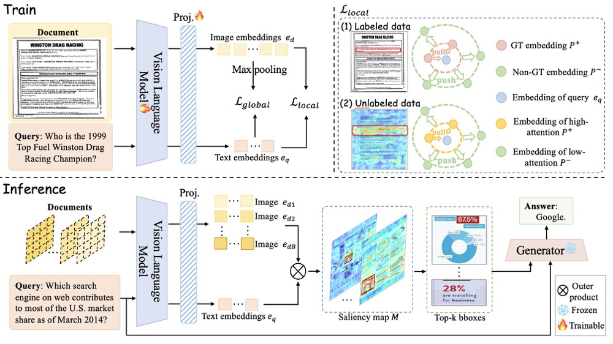

# RegionRAG
The official implementation of RegionRAG: Region-level Retrieval-Augmented Generation
for Visual Document Understanding (AAAI 2026)

[](https://arxiv.org/pdf/2510.27261)

<p align="center">•
 <a href="#-introduction"> 📖 Introduction</a> •
 <a href="#-Environment-Preparation">🛠️ Environment Preparation</a> •
 <a href="#-data-preparation">📊 Data Preparation</a> •
 <a href="#-train">💰 Train</a> 
</p>
<p align="center">•
 <a href="#-checkpoints">🤗 Checkpoints</a> •
 <a href="#-evaluation">🤖 Evaluation</a> •
 <a href="#-citation">📑 Citation</a> •
 <a href="#-acknowledgement">👍 Acknowledgement</a> •
 <a href="#-license">🔒 License</a>
</p>


## 📖 Introduction
RegionRAG addresses this core limitation by introducing a **region-level RAG framework** tailored for visual documents. Instead of retrieving entire images, RegionRAG retrieves fine-grained, semantically meaningful visual regions that are highly relevant to the query. Our method features:
- **Region-level multimodal contrastive learning**, enabling accurate alignment between text queries and local visual regions.
- **Neighbor-based region grouping inference**, allowing robust region extraction without relying on OCR or brittle layout heuristics.
- **Efficient and precise region-based generation**, which reduces irrelevant context and significantly boosts accuracy across visual document QA benchmarks.

Experiments show that RegionRAG delivers more precise retrieval, higher-quality generation, and better efficiency than existing image-level RAG pipelines—demonstrating that visual document information is inherently local, and retrieval should be too.


## 🛠️ Environment Preparation
```python
git clone https://github.com/Aeryn666/RegionRAG.git
cd RegionRAG
conda install pytorch==2.5.1 torchvision==0.20.1 torchaudio==2.5.1 pytorch-cuda=12.1 -c pytorch -c nvidia
pip install numpy==1.26.4
pip install -r requirements.txt
pip install -e .
```
If you encounter the error ```ImportError: undefined symbol: iJIT_NotifyEvent```, please downgrade MKL to a compatible version that is available in your environment, for example:
```python
conda install -y mkl=2023.1.0
```

## 📊 Data Preparation
We put all our training and evaluation model under ```models``` folder. The structure are here:
```python
RegionRAG
├── data_dir
│   ├── VisRAG-Ret-Train-In-domain-data  # train
│   ├── Visual-CoT
│   │   ├── docvqa
│   │   ├── textcap
│   │   ├── textvqa
│   │   └── infographicsvqa
│   ├── VisRAG  # eval
│   │   ├── VisRAG-Ret-Test-ArxivQA
│   │   ├── VisRAG-Ret-Test-ChartQA
│   │   ├── VisRAG-Ret-Test-InfoVQA
│   │   ├── VisRAG-Ret-Test-MP-DocVQA
│   │   ├── VisRAG-Ret-Test-PlotQA
│   │   └── VisRAG-Ret-Test-SlideVQA
│   └── ViDoRe
├── models
│   ├── Qwen2.5-VL-3B-Instruct
│   ├── Qwen2.5-VL-7B-Instruct
│   └── RegionRet
```

## 💰 Train
We initialized RegionRetriever with [Qwen2.5-VL-3B](https://huggingface.co/Qwen/Qwen2.5-VL-3B-Instruct) for training, while the Generator is used as an off-the-shelf model without additional training. We train our model for five epochs on a mixture of the unlabeled dataset from [VisRAG in-domain data](https://huggingface.co/datasets/openbmb/VisRAG-Ret-Train-In-domain-data) and the document-focused subset of [Visual-CoT](https://huggingface.co/datasets/deepcs233/Visual-CoT) for labeled, bounding-box level supervision. Train scripts are under ```scripts/train``` folder.
```python
bash scripts/train/train.sh
```

## 🤗 Checkpoints
We will release our trained checkpoint in Huggingface.

## 🤖 Evaluation
Evaluation scripts are under ```scripts/eval``` folder. The ```scripts/eval/eval.sh``` script consists of two parts: evaluation of retrieval results and evaluation of generation results.
Generation can be done in two ways: local transformer deployment or API deployment.
```
bash scripts/eval/eval.sh
```
If you want to evaluate performance on different datasets, you need to refer to the dataset information in ```scripts/eval/dataset.sh``` and modify ```dataset_name``` and ```dataset_path``` in eval.sh.

## 📑 Citation
If you find our work useful for your research and applications, please cite using this BibTeX:
```bibtex
@misc{li2025regionragregionlevelretrievalaugumentedgeneration,
      title={RegionRAG: RegionRAG: Region-level Retrieval-Augumented Generation for Visually-Rich Documents}, 
      author={Yinglu Li and Zhiying Lu and Zhihang Liu and Chuanbin Liu and Hongtao Xie},
      year={2025},
      eprint={2510.27261},
      archivePrefix={arXiv},
      primaryClass={cs.CV},
      url={https://arxiv.org/abs/2510.27261}, 
}
```

## 👍 Acknowledgement
The codebase of RegionRAG is adapted from [ColPali](https://github.com/illuin-tech/colpali). We are also grateful for the following projects our RegionRAG arise from [Qwen2.5](https://huggingface.co/collections/Qwen/qwen25).

## 🔒 License
This project is released under the Apache 2.0 license as found in the LICENSE file. The service is a research preview intended for non-commercial use ONLY.